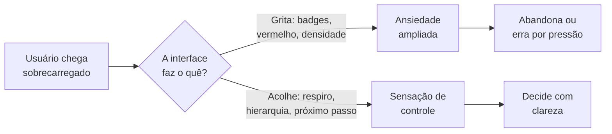

# Design Psychology — A Psicologia por Trás da Interface

## Propósito

Este documento explica **por que** a FeelWorks se parece com o que se parece.

Não é um guia de UI (isso é `03_DESIGN_SYSTEM`). É a camada abaixo: o **estado
emocional** que cada decisão visual produz no usuário, e por que escolhemos produzir
esse estado e não outro.

Se você entender este documento, você consegue tomar uma decisão de design nova
— que não está escrita em lugar nenhum — e acertar o tom da FeelWorks.

> **Audiência:** design, produto, engenharia de front-end e o Claude Code ao
> construir qualquer tela.

---

## A premissa central

> **O inimigo número 1 do nosso usuário não é a falta de features. É a ansiedade
> operacional.**

O assessor da FeelWorks vive num estado de sobrecarga de baixo grau: WhatsApp
piscando, oportunidades meio-formadas, prazos vagos, gente esperando resposta. Ele
não chega ao nosso produto calmo. Ele chega **já no vermelho**.

A maioria dos SaaS de produtividade piora isso: badges vermelhos, contadores,
gráficos que sobem e descem, notificações que competem por atenção. Eles confundem
*densidade de informação* com *valor*. O resultado é uma interface que grita.

**A FeelWorks faz o oposto por decisão consciente:** a interface é o único lugar
calmo no dia do assessor. Cada escolha visual abaixo existe para gerenciar o estado
emocional dele em direção a **calma + sensação de controle**, nunca em direção a
urgência manufaturada.

Tudo abaixo deriva dessa premissa.

---

## Princípio 1 — Vermelho é recurso escasso

**A regra:** vermelho quase nunca aparece. Quando aparece, significa exatamente uma
coisa: *algo quebrou ou vai quebrar e só você pode consertar agora.*

**A psicologia:** cor de alerta funciona por contraste com um fundo neutro. Se tudo
é vermelho — notificação, badge, delta negativo, botão de excluir — o cérebro
aprende que vermelho não quer dizer nada, e o alerta real se perde no ruído. Pior:
exposição contínua a vermelho eleva vigilância de baixo grau (o corpo lê como
ameaça). Uma tela cheia de vermelho **cansa** antes de informar.

**Como aplicamos:**
- Deltas negativos ("-19% vs. mês passado") usam um tom sardento/terroso, não
  vermelho-sangue. É informação, não emergência.
- Ações destrutivas usam vermelho **só no momento da confirmação**, nunca no estado
  de repouso.
- Status "rejeitado/cancelado" usa um tom suave contornado, não um bloco vermelho
  cheio.

**Anti-padrão:** ❌ pintar todo número que caiu de vermelho. Um dashboard onde
metade dos KPIs está vermelha comunica "está tudo desabando" quando na verdade
está tudo normal — alguns sobem, outros descem.

---

## Princípio 2 — O card precisa respirar

**A regra:** cards têm espaço interno generoso. Não compactamos para caber mais na
tela.

**A psicologia:** espaço em branco (whitespace) não é espaço "perdido" — é o que
diz ao cérebro onde uma unidade de informação começa e termina. Sem respiro, o olho
não consegue agrupar (lei de Gestalt da proximidade) e a leitura vira esforço
consciente. Densidade alta economiza pixels e gasta **atenção** — a única coisa que
o assessor não tem sobrando.

**Como aplicamos:**
- Um card = uma unidade de sentido, com folga em volta do conteúdo.
- Preferimos rolar a página a espremer dois cards na mesma altura.
- O respiro também carrega significado: espaço = calma = "você tem tempo pra ler
isto".

**Ligação com MentalModels:** isto é o MM1 (*Tudo gira em torno de contexto*) na
prática — contexto precisa de espaço pra aparecer. Compactar = amputar contexto.

**Anti-padrão:** ❌ "está sobrando espaço, vamos aproveitar e colocar mais um
gráfico aqui." O espaço *é* o design, não um vazio a preencher.

---

## Princípio 3 — Dashboard de baixa densidade

**A regra:** a Home mostra poucas coisas, grandes e claras. Não é um cockpit de
avião.

**A psicologia:** a capacidade da memória de trabalho é pequena (na faixa de poucos
itens simultâneos). Um dashboard com 20 widgets não dá ao usuário 20x mais poder —
dá paralisia. Quando tudo pede atenção ao mesmo tempo, nada recebe, e a pessoa
trava na decisão de *por onde começar*. Isso é ansiedade operacional em estado puro.

**Como aplicamos:**
- A Home responde a UMA pergunta: "o que eu faço agora?" — não "tudo que existe".
- Hierarquia forte: uma coisa é claramente a mais importante da tela.
- O resto fica a um clique de distância, não empilhado na primeira dobra.

**Ligação com MentalModels:** MM4 (*Toda informação precisa produzir uma ação*).
Se um widget não leva a uma ação clara, ele não merece a Home.

**Anti-padrão:** ❌ a Home como vitrine de "tudo que o produto faz". Densidade
impressiona numa demo de vendas e sufoca no uso diário.

---

## Princípio 4 — Gráfico só quando muda uma decisão

**A regra:** evitamos gráficos por padrão. Um gráfico existe só se responde a uma
pergunta que o usuário realmente faz e que muda o que ele faz em seguida.

**A psicologia:** gráfico é caro cognitivamente — exige decodificar eixos, escala,
tendência, antes de extrair sentido. Muitos produtos usam gráfico como *decoração
de credibilidade* ("parece analítico, logo parece sério"). Mas gráfico sem pergunta
é ruído bonito: ocupa a parte mais nobre da atenção e não devolve decisão nenhuma.

**Como aplicamos:**
- Um número grande + o delta em texto ("97, +35% vs. mês passado") costuma bater
  qualquer gráfico de linha para a mesma informação.
- Se usamos gráfico, ele tem um título que é a pergunta que responde.
- Reputação usa o **heatmap de Ritmo** (estilo contribution graph) — e isso *não
  é exceção* a esta regra: ele responde "esta pessoa trabalha de forma consistente?"
  com um olhar, sem decodificação de eixo. É densidade a serviço de uma pergunta.

**Ligação com MentalModels:** MM2 (*Dados existem para gerar decisões*).

**Anti-padrão:** ❌ encher a tela de sparklines e donuts porque "dashboard tem que
ter gráfico". Pergunte antes: que decisão este gráfico muda? Se não houver, corte.

---

## Princípio 5 — Calma é o estado emocional padrão

**A regra:** o default de qualquer tela é silêncio visual. Movimento, cor e som são
introduzidos com parcimônia e sempre com propósito.

**A psicologia:** o sistema visual humano é fisiologicamente atraído por movimento
e contraste alto (herança de detectar predador/movimento na periferia). Animação
gratuita, badge pulsando, cor saturada — tudo isso sequestra atenção de forma
involuntária e deixa um resíduo de tensão. Uma interface "animada demais" é
literalmente cansativa de olhar por 8 horas.

**Como aplicamos:**
- Paleta base: paper off-white, tinta quase-preta. Violeta (#6C5BFF) é a marca e
  entra como acento, não como banho.
- Movimento serve à continuidade (mostrar de onde algo veio/pra onde foi), nunca
  à decoração.
- Dados em tipografia mono — vocabulário GitHub, sensação de ferramenta séria e
  quieta, não de app de gamificação.

**Anti-padrão:** ❌ confetes, micro-animações em todo hover, números que "contam pra
cima" ao carregar. Diverte na primeira vez, irrita na centésima.

---

## Princípio 6 — Sensação de controle acima de tudo

**A regra:** o usuário sempre sente que está no comando. O sistema é previsível,
reversível e nunca age pelas costas dele.

**A psicologia:** ansiedade é, em boa parte, *perda percebida de controle*. Duas
coisas devolvem controle: **previsibilidade** (eu sei o que vai acontecer se eu
clicar) e **reversibilidade** (se eu errar, dou pra trás). A ausência de qualquer
uma das duas gera hesitação — o usuário pára de agir com medo de estragar algo.

**Como aplicamos:**
- **Sempre permitir desfazer.** Undo vale mais que confirmação — confirmação
interrompe, undo deixa fluir e ainda protege.
- **Sempre mostrar progresso.** Nada de spinner mudo: o usuário vê em que passo
está.
- **Nunca esconder estado.** Se algo está pendente, salvando, ou com erro, isso é
visível — estado oculto é a maior fonte de ansiedade em software.
- **IA nunca decide sozinha** (MM3): ela propõe, a pessoa dispõe. O controle é
humano por design.

**Ligação:** este princípio é o coração de `InteractionPhilosophy.md` (a ser
escrito) — aqui está o *porquê* psicológico; lá estarão as regras práticas.

**Anti-padrão:** ❌ ações automáticas "pra ajudar" que o usuário não pediu e não
consegue desfazer. Economiza um clique e destrói a sensação de comando.

---

## Princípio 7 — Confiança se constrói com transparência, não com polído

**A regra:** mostramos como as coisas funcionam. Não escondemos lógica, origem de
dado, nem o fato de que a IA foi usada.

**A psicologia:** confiança não vem de uma interface bonita — vem de
**previsibilidade cumprida ao longo do tempo**. Toda vez que o sistema faz o que
prometeu e explica o porquê, deposita confiança. Toda caixa-preta ("por que este
candidato apareceu?") saca confiança. Em um produto cuja tese é *reputação
verificável*, opacidade não é só UX ruim — contradiz o produto.

**Como aplicamos:**
- Todo dado mostra sua origem quando possível (o "realce de origem" do ticket
extraído: qual trecho do briefing gerou aquele campo).
- Quando a IA propõe algo, mostramos que foi a IA e deixamos editar.
- Reputação é **fato contável** (nº de provas, marcas), nunca um score opaco —
  ver `Principles.md` P4. Score seria a caixa-preta máxima.

**Anti-padrão:** ❌ "a mágica acontece por trás". Em outros produtos, mágica
encanta. No nosso, cheira a algoritmo escondido — exatamente o que combatemos.

---

## Síntese: como reduzir ansiedade operacional (checklist)

Antes de finalizar qualquer tela, passe por aqui:

- [ ] Existe **uma** coisa claramente mais importante nesta tela?
- [ ] Cada bloco de informação tem um **próximo passo** óbvio? (MM4)
- [ ] O vermelho, se existe, significa emergência real e acionável?
- [ ] Os cards **respiram**, ou eu espremi pra caber mais?
- [ ] Cada gráfico responde a uma pergunta que muda uma decisão? Se não, cortei?
- [ ] O usuário consegue **desfazer** o que fez aqui?
- [ ] Algum estado (salvando, pendente, erro) está **escondido**?
- [ ] A tela deixa o usuário mais **calmo** ou mais **acelerado**?

Se a última resposta for "acelerado", volte ao começo.

---

## Ligações cruzadas

- [`MentalModels.md`](../00_FOUNDATION/MentalModels.md) — os 6 modelos que estes
  princípios materializam (especialmente MM1, MM2, MM4).
- [`Principles.md`](../00_FOUNDATION/Principles.md) — P2 (Contexto > Simplicidade),
  P4 (Fatos > Interpretações).
- `InteractionPhilosophy.md` (a escrever) — as regras práticas de interação cujo
  *porquê* está no Princípio 6.
- `AttentionSystem.md` (a escrever) — quando algo merece badge/push/e-mail; é a
  aplicação operacional do Princípio 1 e 5.
- `03_DESIGN_SYSTEM/ColorSystem.md` (a escrever) — os valores concretos de cor que
  este documento justifica.

---

_Última revisão: julho/2026 | Contribuidores: Gabriel Quental + Claude Code_
_Documento piloto da seção 04_UX — estabelece o nível de escrita das próximas seções._
